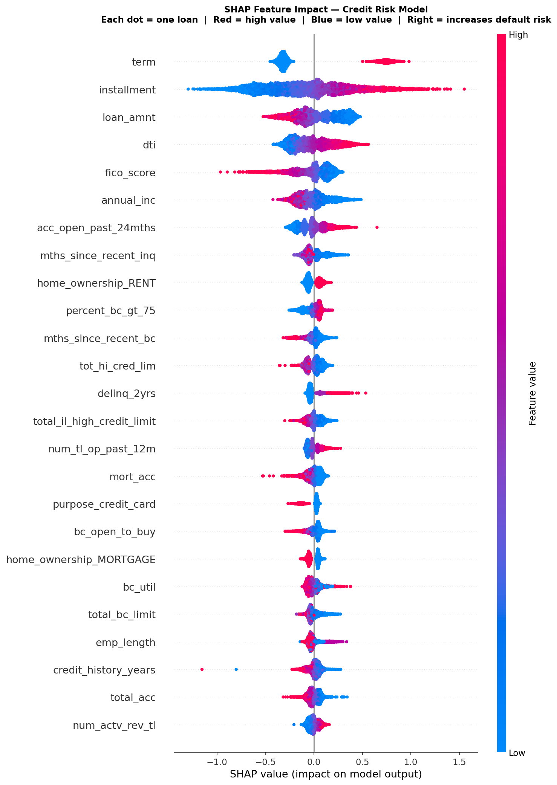
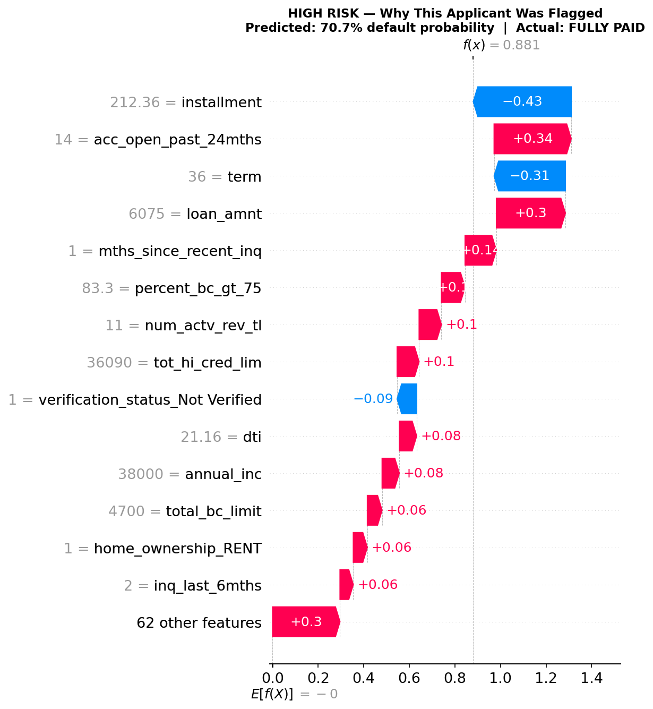
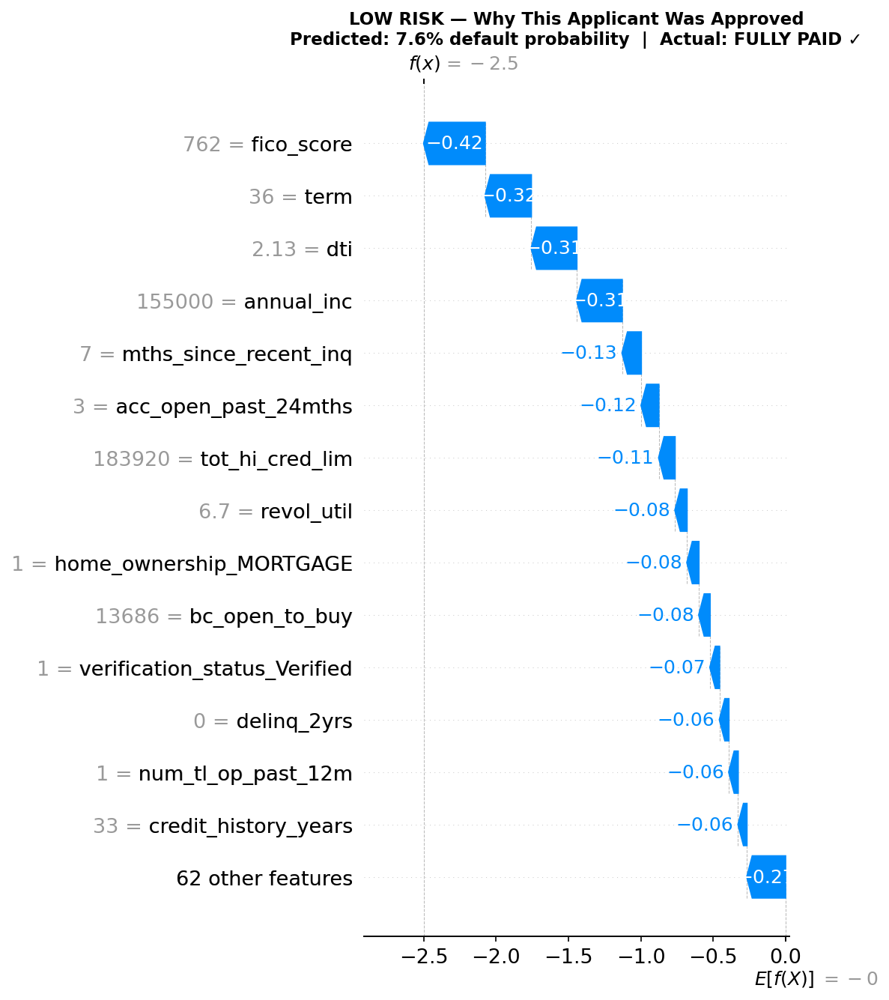

# Credit Risk Scoring Engine

A production-grade machine learning system that predicts loan default probability in real time, with per-decision SHAP explanations for regulatory auditability.

## 🔴 Live API
**Base URL:** https://credit-risk-api-s6ha.onrender.com  
**Interactive Docs:** https://credit-risk-api-s6ha.onrender.com/docs

> Note: Free tier spins down after inactivity — first request may take 60 seconds to wake up.

---

## 📋 Project Overview

This project was built to directly address the limitations identified in a prior industry project with SAS Institute Australia, where a credit risk model was built on the small HMEQ dataset (5,960 records) with no deployment capability.

| Aspect | SAS Project | This Project |
|---|---|---|
| Dataset | HMEQ — 5,960 rows | Lending Club — 1,344,441 rows |
| Features | 13 | 76 |
| Missing value handling | dropna() — lost 44% of data | Stratified median imputation — 0% lost |
| Data leakage check | Not required | 16 leaky columns identified and removed |
| Explainability | Global feature importance only | Per-decision SHAP explanations |
| Deployment | Jupyter notebook only | Live REST API with Docker |

---

## 📊 Model Performance

| Model | AUC | Gini Coefficient | KS Statistic |
|---|---|---|---|
| Logistic Regression (baseline) | 0.7108 | 0.4216 | 0.3046 |
| XGBoost (untuned) | 0.7254 | 0.4507 | 0.3254 |
| **XGBoost (tuned — final)** | **0.7294** | **0.4588** | **0.3304** |

> Industry benchmarks: Gini > 0.40, KS > 0.30. Both cleared on production-valid features.

**Key finding:** Initial model achieved Gini 0.4599 with `grade` and `int_rate` included. These were identified as circular predictors — Lending Club assigns them after their own risk assessment, meaning they would not exist for a new applicant at scoring time. Removing them reduced Gini marginally to 0.4588 but produced a production-valid model.

---

## 🔍 SHAP Explainability

Unlike global feature importance, SHAP produces a personalised explanation for every single prediction — showing exactly which features drove each decision and by how much.

### Global Feature Impact


### High Risk Applicant — Why They Were Flagged


### Low Risk Applicant — Why They Were Approved


### Applicant Comparison

| Feature | High Risk | Low Risk |
|---|---|---|
| Term | 36 months | 36 months |
| FICO Score | 692 | 762 |
| Debt-to-Income Ratio | 21.2% | 2.1% |
| Annual Income | $38,000 | $155,000 |
| Delinquencies (2yr) | 0 | 0 |
| Credit History | 17 years | 33 years |
| **Predicted Default Probability** | **70.7%** | **7.6%** |

---

## 🔑 Key Analytical Findings

**Loan term is the strongest predictor**
60-month loans default at 32.5% vs 16.0% for 36-month loans — more than double the rate. Longer exposure to life events (job loss, illness) explains this.

**FICO score shows perfect monotonic relationship with default**
Default rates decrease consistently across every FICO band from 26.3% (650-670) down to 8.3% (760+) — validating the model's credit score weighting.

**DTI finding from SAS project partially validated**
DEBTINC was the #1 predictor at 21% importance in the SAS project on HMEQ (13 features). On Lending Club with 76 features, DTI ranks #10 at 2.3% — still meaningful but no longer dominant. The richer feature set distributes predictive power more appropriately across multiple risk signals.

---

## 🏗️ Architecture

Raw Data (2.26M rows)

↓

Data Cleaning Pipeline

Target filtering (keep Fully Paid / Charged Off)
Leakage removal (16 post-loan columns removed)
Outlier treatment (winsorisation)
Feature engineering (credit_history_years, fico_score)
Stratified median imputation (0% data loss)

↓

XGBoost Model (500 trees, tuned via RandomizedSearchCV)

↓

SHAP TreeExplainer (per-decision explanations)

↓

FastAPI REST Endpoint

↓

Docker Container

↓

Render Cloud Deployment (Singapore region)

---

## 🚀 API Usage

**Health Check**

GET https://credit-risk-api-s6ha.onrender.com/

**Score a Loan Application**

POST https://credit-risk-api-s6ha.onrender.com/predict

**Example Request:**
```json
{
  "loan_amnt": 15000,
  "term": 60,
  "annual_inc": 45000,
  "dti": 28.5,
  "fico_score": 670,
  "home_ownership": "RENT",
  "purpose": "debt_consolidation"
}
```

**Example Response:**
```json
{
  "status": "success",
  "prediction": {
    "default_probability": 0.6821,
    "default_probability_pct": "68.2%",
    "risk_tier": "High Risk",
    "recommendation": "Senior review or decline"
  },
  "explanation": {
    "top_risk_factors": [
      {"feature": "term", "value": 60, "impact": 0.42, "direction": "increases risk"},
      {"feature": "dti", "value": 28.5, "impact": 0.18, "direction": "increases risk"}
    ],
    "top_protective_factors": [
      {"feature": "fico_score", "value": 670, "impact": -0.09, "direction": "decreases risk"}
    ]
  }
}
```

---

## 🛠️ Tech Stack

| Layer | Technology |
|---|---|
| Data processing | Python, Pandas, NumPy |
| Machine learning | XGBoost, Scikit-learn |
| Explainability | SHAP |
| API framework | FastAPI |
| Containerisation | Docker |
| Cloud deployment | Render |
| Version control | Git, GitHub |

---

## 📁 Repository Structure

credit-risk-scoring-engine/

│

├── notebooks/

│   ├── 01_data_exploration.ipynb

│   ├── 02_data_cleaning.ipynb

│   ├── 03_modelling.ipynb

│   ├── 04_tuning.ipynb

│   └── 05_shap_explainability.ipynb

│

├── api/

│   ├── main.py              # FastAPI application

│   ├── Dockerfile           # Container definition

│   └── requirements.txt     # Dependencies

│

├── models/

│   ├── xgboost_credit_risk_v2.pkl

│   └── feature_list.pkl

│

├── images/

│   ├── shap_summary.png

│   ├── shap_waterfall_highrisk.png

│   └── shap_waterfall_lowrisk.png

│

└── README.md

---

## 🏃 Run Locally

```bash
# Clone the repository
git clone https://github.com/ashrafwasim/credit-risk-scoring-engine.git

# Navigate to api folder
cd credit-risk-scoring-engine/api

# Build Docker container
docker build -t credit-risk-api .

# Run container
docker run -p 8000:8000 credit-risk-api

# Open in browser
http://127.0.0.1:8000/docs
```

---

## 👤 Author

**Mohammad Wasim Ashraf**  
Master of Analytics — RMIT University (2025)  
Industry Project — SAS Institute Australia  
GitHub: [@ashrafwasim](https://github.com/ashrafwasim)


